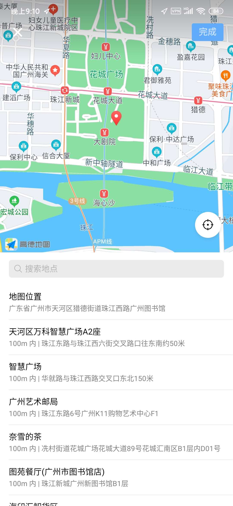

### acknowlege
感谢[flutter deer](https://github.com/simplezhli/flutter_deer/)提供的设计图和图片素材。<br>
感谢[uview](https://github.com/YanxinNet/uView)，简洁好用的组件不仅有出色的使用体验，其代码也对此项目起到了参考作用。(如components/order-swiper）
### images
**安卓app端实际运行截图**
|     |      |    |     |
| :--------------------------------: | :---------------------------------: | :-------------------------------: | :-------------------------------:  |
|     |      |    |     |
|     |     |    |   |
|     |     |    |   |

### fix
修改了u-action-sheet的源码
```css
.u-action-sheet-item {
		display: flex;
		line-height: 1;
		justify-content: left;
		margin-left: 20rpx;
		align-items: center;
		font-size: 34rpx;
		padding: 34rpx 0;
}
```
### helpme
仓库的[helpme](./HELPME.md)文档记录编码时遇到的问题和解决方法。
